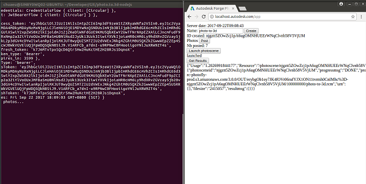

# Photo to 3D (photogrammetry) sample

## Description
This sample illustrates the Reality Capture API's photogrammetry workflow:
- Create a photo scene
- Add photos to a scene
- Generate a 3D mesh model
- Obtain a download link for the model

## Setup & Run
1. Setup
   - Install `npm` (if you haven't already).
   - Install `npm` packages using the command `npm install`.
     - Make sure that the current directory contains `package.json`.
   - Ensure that in your hosts file you have mapped:
     - `127.0.0.1 localhost.autodesk.com`
   - Replace the `client_id` and `client_secret` variable values in `phototo3d.js` with your Forge credentials.

2. Execute `node phototo3d.js`
   - The node server will listen on on port `80`.

3. Open a browser and navigate to `http://localhost.autodesk.com/`.

4. Click on the `Authorize me` link and login to your Autodesk account.
   - In your console, you should see `Server listening on port 80`.
   - In the browser, you should see a HTML form.
   - Enter a scene name in the `Name` field and work the buttons from the top down while observing the messages on the console.

